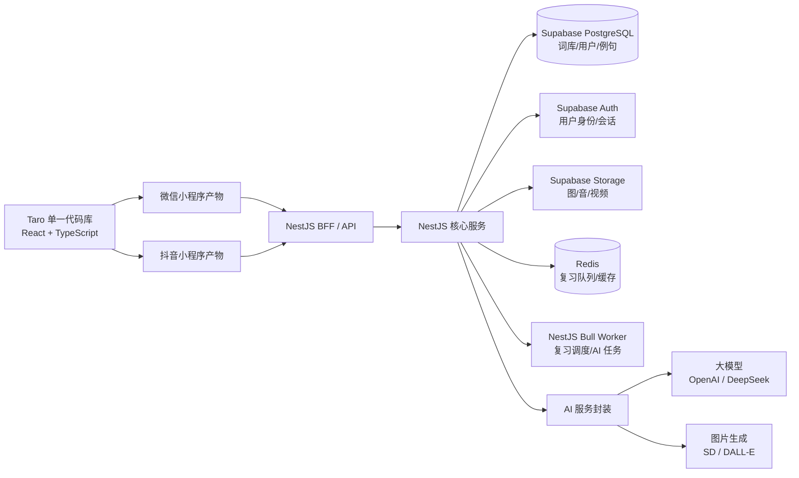
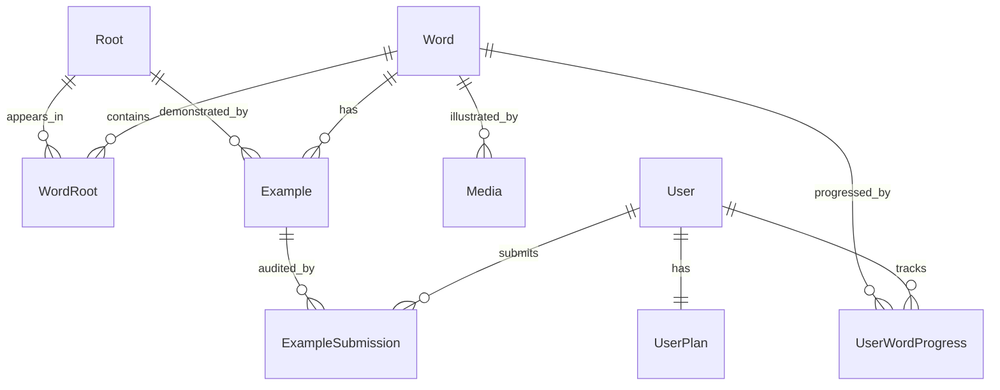

# 背单词小程序 PRD

> 文档版本：v1.0  
> 平台：微信小程序 + 抖音小程序（Taro 单一代码库）  
> 目标用户：四六级、考研、雅思/托福备考者（MVP），全年龄段（长期）  
> 商业模式：完全免费 + 激励视频广告

---

## 1. 产品定位

- **产品名候选**：`词根侠` / `拆词记` / `RootMaster` / `词根树`（待定）
- **一句话定位**：用词根拆解 + 多模态记忆 + 艾宾浩斯科学复习，让背单词从"硬记"变"推理"的免费小程序。
- **平台**：微信小程序 + 抖音小程序，**双端共用一套 Taro 代码**（目标复用率 ≥90%，差异通过 `process.env.TARO_ENV` 条件分支隔离）。
- **差异化**：市面背单词应用普遍是"卡片+遗忘曲线"，本产品的核心壁垒是 **词根知识图谱 + AI 辅助拆解 + 思维导图 + 5 类分层例句**，做"懂结构地背"。

---

## 2. 目标用户与场景

### 2.1 用户画像

| 用户类型 | 核心诉求 | 痛点 |
| --- | --- | --- |
| 四六级考生 | 短期通过考试 | 词汇量大、易遗忘、缺少语境 |
| 考研党 | 高强度长周期 | 需要持续动力与科学复习 |
| 雅思/托福考生 | 高难度词汇 + 学术语境 | 真题语境例句稀缺、词根掌握薄弱 |
| 中小学生（长期） | 应试 + 兴趣启蒙 | 需要趣味化、可视化 |
| 职场人士（长期） | 商务/行业英语 | 时间碎片化、需场景化记忆 |

### 2.2 核心使用场景

- 通勤地铁：5–15 分钟碎片学习
- 睡前：10 分钟轻量复习
- 自习室：30 分钟以上专注学习
- 课堂/会议间隙：3–5 分钟微复习

---

## 3. 核心功能模块（按优先级排序）

### 3.1 词根拆解记忆（P0，核心壁垒）

#### 功能描述

- **可视化拆词**：单词卡按 `前缀 | 词根 | 后缀` 三段式着色展示，点击任一段查看含义与同源词。
  - 示例：`reconstruction` → `re-`(再) + `con-`(共同) + `struct`(建造) + `-ion`(名词后缀)
- **词根详情页**
  - 词源（拉丁/希腊/古英语）
  - 核心含义 + 引申义
  - 派生词列表（按难度/词频排序）
  - 词根故事（短文 + 配图，趣味化）
- **类比推导练习**：给一个未学过的生词，让用户基于已学词根猜含义，答对得熟练度加成。
- **AI 辅助拆解**：对超纲词或冷僻词，调用大模型实时生成合理拆解（含词源校验，避免胡编）。

#### 交互细节

- 拆词时使用渐入动画，每段词根从中心扩散
- 点击词根高亮所有派生词链路
- 长按词根可加入"词根学习清单"

### 3.2 艾宾浩斯科学复习（P0）

#### 功能描述

- **复习节点**：5 分钟 / 30 分钟 / 12 小时 / 1 天 / 2 天 / 4 天 / 7 天 / 15 天 / 30 天
- **算法**：基于 SM-2（Anki 同款）改良，考虑用户每张卡的"反应时间 + 正确率"动态调整间隔
- **熟练度等级**：陌生 / 模糊 / 认识 / 熟练 / 永久 五级，UI 用进度环呈现
- **学习计划**：用户输入考试日期 → 系统反推每日新词量 + 复习量
- **提醒**：小程序订阅消息（微信）/ 系统通知（抖音）

#### 减压设计

- 复习量过大时支持"今日仅复习核心 N 个"减压模式
- 错词不做绝对错误数展示，只显示成长曲线
- 支持"暂停学习计划"，避免断更焦虑

### 3.3 多模态记忆辅助（P0）

- **场景图片**：每个单词关联一张语义图（高频词人工配图，长尾词 AI 生成 + 人工审核）
- **动图/短视频**：动作类（`crawl`、`stumble`）、抽象类（`oscillate`、`fluctuate`）优先配 GIF/3–5 秒短视频
- **发音**：英美双发音 + 真人慢速跟读 + 口型动画（高频词）
- **语境录音**：核心词汇配真人语境录音（句子级）

### 3.4 例句体系（P0，独立核心模块）

例句是承接"词根拆解 + 语境记忆"的关键，独立设计、双向打通。

#### 3.4.1 每词最少 5 条分层例句

| 层级 | 数量 | 内容 | 标识 |
| --- | --- | --- | --- |
| 基础句 | 1 条 | 词组级别短句，CET-4 难度 | 蓝色标签 |
| 真题句 | 1–2 条 | 四六级 / 考研 / 雅思 / 托福真题原句，标注年份与题型 | 金色标签 |
| 经典句 | 1 条 | 影视/演讲/文学，带出处与短视频片段（TED、电影台词） | 紫色标签 |
| 进阶句 | 1 条 | 高级词或学术语境（论文/外刊） | 红色标签 |
| 词根迁移句 | 1 条 | 同词根派生词出现的句子，强化"词根→单词→例句"链路 | 绿色标签 |

#### 3.4.2 例句富信息

- **朗读音频**：英美双音 + 慢速版 + 真人语境录音
- **中英对照**：可隐藏中文做盲听/盲读训练
- **同步高亮**：朗读时单词级跟读高亮（卡拉 OK 式）
- **难词点查**：句中其他生词长按可弹出释义卡，不打断阅读流
- **语法标注（可选）**：从句、固定搭配、介词使用高亮，开关式呈现

#### 3.4.3 例句驱动练习

| 练习类型 | 玩法 |
| --- | --- |
| 例句完形 | 挖空目标词或同词根词，让用户填空 |
| 例句听写 | 听音频写整句话，词级评分 |
| 例句翻译 | 中译英，命中目标词 + 表达自然度双维度评分 |
| 例句配图 | 4 句选 1 配图，考验语境理解 |
| 跟读评分 | 调用语音识别打分，纠正发音 |

#### 3.4.4 UGC 与 AI 协同

- 用户可提交例句，社区点赞 ≥N 后入库（强制人工审核）
- 冷词由 LLM 实时生成例句 + 人工抽检反馈，沉淀为正式例句
- 用户标记"例句不自然" → 进入复审队列

#### 3.4.5 词根级例句

- 词根详情页提供"展示词根含义最经典的 3 个例句"，跨多个派生词
- 形成"词根 → 派生词 → 例句"的三级语义网

### 3.5 词根思维导图（P0）

- **以词根为中心**：辐射出派生词、同源词、近义反义、形近词
- **可缩放/拖拽**：使用 canvas 2d 实现，节点可点击进入详情
- **主题导图**：预置如"医学词根 `medi-`"、"经济 `econom-`"、"光与视觉 `vis-/spect-`"等专题包
- **个人导图**：用户已学词根自动汇聚成个人知识图谱，作为成就感载体
- **导图分享**：可一键导出为图片分享，带二维码引流

### 3.6 学练测复闭环（P0）

| 环节 | 形态 |
| --- | --- |
| **学** | 拆解 + 图/视频 + 例句 + 词根关联 |
| **练** | 选择题 / 拼写 / 听写 / 词根填空 / 例句完形 |
| **测** | 每日小测（10 题）+ 单元测验 + 模考 |
| **复** | 艾宾浩斯到期推送 + 错词本自动归集 |

---

## 4. 辅助功能（P1）

| 功能 | 说明 |
| --- | --- |
| 词库选择 | 四六级 / 考研 / 雅思 / 托福 / GRE（MVP 先上前 4 个） |
| 生词本 | 手动添加 + 自动归集（连续答错 ≥2 次入册） |
| 长按查词 | 任意页面长按英文文本即时弹出释义卡 |
| OCR 拍照查词 | 拍英文文章自动框选生词并入库 |
| 学习报告 | 日/周/月，含背词量、正确率、连续打卡、词根掌握地图 |
| 分享卡片 | 单词/词根/学习成就一键生成图片，带二维码 |
| 暗黑模式 | 跟随系统 |
| 单词收藏 | 用户主动收藏，独立于生词本 |
| 单词标签 | 自定义标签（如"易混词"、"商务"） |

---

## 5. UI/UX 设计原则

### 5.1 现代化视觉

- **主色**：深蓝 `#1B2A4E` + 活力橙 `#FF6B35` 渐变
- **辅助色**：成功 `#10B981`、警示 `#F59E0B`、错误 `#EF4444`
- **设计语言**：卡片化 + 玻璃拟态点缀
- **字体**：苹方 / HarmonyOS Sans，单词主标 28–32px
- **图标**：Lucide / Heroicons 风格，统一 24px 线条

### 5.2 流畅交互

- **微信端**：使用 Skyline 渲染引擎，目标 60fps
- **单词卡手势**
  - 左滑：标记"陌生"
  - 右滑：标记"熟练"
  - 上滑：查看词根详情
  - 下滑：收藏
  - 双击：朗读
- **微动效**：词根高亮、拆词扩散、答对烟花、连击提示、进度环转动

### 5.3 降低焦虑感

- 不显示绝对错误数，只显示"成长曲线"
- 复习量过大时支持"今日仅复习核心 N 个"减压模式
- 失败动画温和，避免红色警示
- 鼓励文案："今日小步前进"代替"今日还差 X 个"

### 5.4 无障碍

- 大字号模式
- 长按朗读
- 色盲友好（红绿不作唯一区分，配合形状区分）
- 减少动画选项（系统级开关跟随）

---

## 6. 技术架构



### 6.1 前端：双端单一代码库（Taro 4 + React + TypeScript）

#### 设计原则

- **目标复用率 ≥90%**，差异通过 `process.env.TARO_ENV === 'weapp' | 'tt'` 条件分支隔离
- 业务代码对平台无感知，所有差异收敛到 `src/platform/*` 适配层

#### 目录结构

```
src/
├── pages/               # 共享页面
│   ├── home/
│   ├── learn/
│   ├── word-detail/
│   ├── root-detail/
│   ├── mindmap/
│   └── profile/
├── components/          # 共享组件
│   ├── word-card/
│   ├── example-list/
│   ├── root-tree/
│   └── progress-ring/
├── services/            # 共享 API/存储/算法
│   ├── api/
│   ├── storage/
│   └── sm2/             # SM-2 复习算法
├── store/               # Zustand 状态管理
├── platform/            # 平台差异层（关键）
│   ├── index.ts         # 统一接口导出
│   ├── weapp/
│   └── tt/
└── styles/              # UnoCSS + 设计 tokens
```

#### 关键平台差异点统一封装

| 能力 | 微信 | 抖音 | 抽象接口 |
| --- | --- | --- | --- |
| 登录 | `wx.login` + 后端 code2session | `tt.login` + 抖音 OpenAPI | `auth.login()` |
| 订阅消息 | 订阅消息模板 | 系统通知 | `notify.subscribe()` |
| 激励视频 | 微信广告组件 | 抖音穿山甲 | `ad.showRewarded()` |
| 支付（预留） | 微信支付 | 抖音支付 | `pay.create()` |
| 分享 | `onShareAppMessage` | `onShareAppMessage` | 共用 |
| 渲染层 | 启用 Skyline | 默认 WebView | 编译配置切换 |

#### 技术选型

| 维度 | 选型 |
| --- | --- |
| 框架 | Taro 4 |
| 视图层 | React 18 + TypeScript |
| 状态管理 | Zustand（轻量、跨端无副作用） |
| 样式 | UnoCSS 原子化 + CSS 变量做 tokens |
| 网络 | `taro.request` + 自封装拦截器 |
| 离线 | 核心词库分包预加载 + `Storage` 缓存，弱网可继续学 |
| 埋点 | 自封装 SDK，平台差异由 `platform` 层处理 |

### 6.2 后端：NestJS 单体起步

#### 框架选型

- **NestJS（TypeScript）**：模块化清晰，DI 友好，便于后期拆微服务
- **ORM**：Prisma（类型安全、与 NestJS DTO 协作流畅）
- **Supabase**：PostgreSQL（业务主库）+ Auth（用户身份/会话）+ Storage（图/音/视频）
- **Redis**：继续保留，用于复习队列、热点缓存与 BullMQ 异步任务
- **任务调度**：`@nestjs/bullmq` + Redis，处理复习到期推送、AI 异步生成、UGC 审核流转
- **可观测**：Pino 日志 + OpenTelemetry + Sentry
- **部署**：Docker + K8s 或腾讯云 Serverless（MVP 阶段）

#### 核心模块

| 模块 | 职责 |
| --- | --- |
| `AuthModule` | 双端登录适配（微信 / 抖音）+ Supabase Auth 会话 |
| `WordModule` | 单词 / 词根 / 词缀 / 派生关系 |
| `ExampleModule` | 例句 CRUD、UGC 提交与审核、AI 生成、点赞与举报 |
| `LearnModule` | 学习计划、SM-2 算法、艾宾浩斯调度 |
| `ReviewModule` | 复习队列、提醒推送 |
| `MediaModule` | Supabase Storage 签名上传 / 媒体元数据 / 转码触发 |
| `AiModule` | LLM 词根拆解 / 例句生成 / 兜底缓存 |
| `AdModule` | 激励视频回调校验 / 反作弊 / 权益发放 |
| `StatsModule` | 埋点接收 / 学习报告聚合 |
| `MindmapModule` | 思维导图节点关系生成 |

#### AI 调用策略

- **缓存优先**：key=`hash(word)` 或 `hash(root)`，命中率达标后近乎零成本
- **冷词降级**：未命中时调 LLM 并回写缓存
- **质量回流**：LLM 结果进入"待审核"状态，人工审核后晋升为正式数据

---

## 7. 核心数据模型

### 7.1 实体定义

| 实体 | 关键字段 |
| --- | --- |
| `Word` | `id, spelling, phonetic_uk, phonetic_us, frequency, level, scenes` |
| `Root` | `id, form, origin, meaning, story, story_image` |
| `WordRoot` | `word_id, root_id, position(prefix/root/suffix), order` |
| `Affix` | `id, form, type, meaning` |
| `Example` | `id, word_id, target_root_id?, sentence, translation, level(basic/exam/classic/advanced/root_transfer), source(cet4/cet6/kaoyan/ielts/toefl/movie/ted/ugc/ai), source_meta(json), audio_uk_url, audio_us_url, audio_slow_url, highlight_spans(json), grammar_tags, status(draft/published/rejected), created_by, likes` |
| `ExampleSubmission` | `id, user_id, example_id, status(pending/approved/rejected), reviewer_id, reviewed_at` |
| `Media` | `id, word_id, type(image/gif/video), url, is_ai_generated` |
| `UserWordProgress` | `user_id, word_id, ease_factor, interval, due_at, review_count, lapses` |
| `UserPlan` | `user_id, exam_type, exam_date, daily_new, daily_review` |
| `User` | `id, platform(weapp/tt), open_id, union_id?, nickname, avatar, created_at` |
| `LearnSession` | `id, user_id, started_at, ended_at, new_count, review_count, accuracy` |

### 7.2 实体关系



---

## 8. 商业化与增长（免费 + 激励视频路线）

### 8.1 激励视频解锁点（克制使用，不挡核心路径）

| 解锁点 | 触发场景 |
| --- | --- |
| AI 词源故事 | 词根详情页"查看词源故事" |
| 高级配图/视频 | 单词卡"高清场景图" |
| 模考报告 | 模考结束后"查看详细分析" |
| 跳过单日复习 | 每日 1 次额度 |
| 高级例句包 | 解锁经典句/进阶句 |

### 8.2 开屏广告

- 仅冷启动展示
- 可跳过（3 秒后）

### 8.3 裂变机制

- 分享单词卡/学习成就 → 被分享方扫码进入得 7 天高级权益
- 邀请好友组队 → 双方得每日复习提速卡

### 8.4 任务体系

- 每日打卡奖励
- 连续登录里程碑（3/7/30 天）
- 词根成就（解锁 N 个词根）
- 例句贡献者勋章（UGC 入库）

---

## 9. MVP 范围与里程碑

由于前端从第一天就基于 Taro 单代码库开发，双端可同步发布，无需后置抖音端。

| 阶段 | 周期 | 范围 |
| --- | --- | --- |
| **M1 闭环 MVP** | 6 周 | 四六级词库 + 词根拆解 + 艾宾浩斯 + 图片 + 5 类例句 + 学练测复 + **微信&抖音同步发布** |
| **M2 多模态&导图** | 4 周 | 思维导图 + 动图/短视频 + 考研词库 + 例句完形/听写 + 学习报告 |
| **M3 增长&扩词库** | 4 周 | 雅思/托福词库 + 激励视频 + 分享裂变 + UGC 例句开放 |

### 9.1 M1 详细拆解（6 周）

| 周次 | 前端 | 后端 |
| --- | --- | --- |
| W1 | Taro 脚手架 + 双端编译验证 + 设计系统 | NestJS 脚手架 + Prisma + Supabase PostgreSQL 表结构 |
| W2 | 单词卡 + 词根拆解 UI + 例句列表 | 词库导入 + Word/Root/Example API |
| W3 | 学习页主流程 + 手势交互 | SM-2 算法 + UserWordProgress |
| W4 | 复习页 + 进度环 + 学习报告基础 | 复习调度（BullMQ + Redis）+ 订阅消息 |
| W5 | 平台适配（登录/分享）+ 暗黑模式 | AuthModule 双端 + Supabase Storage 媒体上传 |
| W6 | 联调 + 性能优化 + 双端提审 | 压测 + 监控 + 数据回流 |

---

## 10. 关键指标

| 维度 | 指标 | 目标 |
| --- | --- | --- |
| 激活 | 注册转化率 | ≥60% |
| 激活 | 首日完成首次背词率 | ≥70% |
| 留存 | 次留 | ≥50% |
| 留存 | 7 留 | ≥35% |
| 留存 | 30 留 | ≥15% |
| 学习深度 | 人均日活时长 | ≥10 分钟 |
| 学习深度 | 日均背词量 | ≥20 个 |
| 学习深度 | 词根学习渗透率 | ≥40% |
| 商业 | 激励视频日人均观看次数 | 1.5–3 次 |
| 商业 | 广告 ARPU | 行业基准 |

---

## 11. 风险与对策

| 风险 | 对策 |
| --- | --- |
| 词根拆解准确性 | 建立 5000+ 词根权威库 + 语言学顾问审核 + AI 兜底 |
| 多媒体成本 | 高频词人工精修，长尾词 AI 生成且懒加载；媒体统一走 Supabase Storage，后续按访问量决定是否叠加 CDN |
| 小程序包体积 | Skyline 分包加载，多媒体全部远程加载，主包 <2MB |
| 抖音审核 | 与微信端做能力差异化适配（如订阅消息替换为系统通知）；提前阅读抖音小程序审核规范 |
| 双端 API 差异 | 所有平台能力（登录/广告/通知/分享）通过 `src/platform/*` 适配层统一接口，业务层零感知，避免散落的 if-else |
| 例句版权 | 真题/影视句标注出处与年份；UGC 例句强制审核；AI 生成例句标注来源避免误导 |
| AI 调用成本 | 缓存优先策略 + 命中率监控；冷启动期人工准备核心词库的拆解结果 |
| 数据冷启动 | 接入开源 ECDICT/简明英汉词典等基础数据，再逐步替换为自有内容 |

---

## 12. 后续规划（V2 及以后）

- 词根学习路径（按主题/词源系统化学习）
- AI 对话练习（用学过的词根生成对话）
- 单词 PK / 组队学习
- 教师端：教师建班、布置任务、查看学情
- 鸿蒙原生应用 / iOS / Android 应用扩展
- 商务英语、医学英语、IT 英语等垂直词库

---

## 附录 A：术语表

| 术语 | 含义 |
| --- | --- |
| 词根（Root） | 单词中承载核心含义的部分，如 `struct`（建造） |
| 前缀（Prefix） | 加在词根前修饰含义的成分，如 `re-`（再） |
| 后缀（Suffix） | 加在词根后改变词性或含义的成分，如 `-ion`（名词后缀） |
| SM-2 | SuperMemo 2 算法，主流间隔重复算法 |
| 艾宾浩斯遗忘曲线 | 描述人类记忆遗忘规律的曲线 |
| Skyline | 微信小程序新一代渲染引擎，性能接近原生 |
| Taro | 京东开源的多端统一开发框架 |

## 附录 B：参考产品

- 不背单词、墨墨背单词、扇贝单词、百词斩、Anki、Quizlet
- 借鉴：Anki 的间隔算法、扇贝的打卡机制、百词斩的图片记忆
- 差异：本产品以**词根知识图谱**为核心壁垒，强化结构化记忆与例句体系
