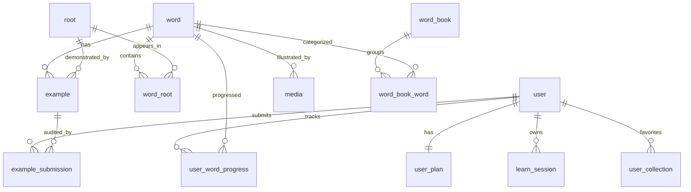

# 数据字典

> 配套文档：[PRD.md](../PRD.md)  
> 基础设施：Supabase Auth + Supabase PostgreSQL + Supabase Storage + Redis 7  
> ORM：Prisma  
> 命名规范：表名 `snake_case` 单数，主键 `id`（bigint），时间字段 `created_at` / `updated_at` / `deleted_at`

---

## 1. 表关系总览

---

## 2. 核心表定义

### 2.1 `user` 用户表

| 字段 | 类型 | 必填 | 索引 | 说明 |
| --- | --- | --- | --- | --- |
| id | bigint | 是 | PK | 主键 |
| platform | enum('weapp','tt') | 是 | idx | 平台来源 |
| open_id | varchar(64) | 是 | uniq(platform,open_id) | 平台 OpenID |
| supabase_user_id | uuid | 否 | uniq | Supabase Auth 用户 ID |
| union_id | varchar(64) | 否 | idx | 微信 UnionID |
| nickname | varchar(64) | 否 |  | 昵称 |
| avatar_url | varchar(512) | 否 |  | 头像 URL |
| gender | smallint | 否 |  | 0 未知 1 男 2 女 |
| status | smallint | 是 |  | 0 正常 1 封禁 |
| created_at | timestamptz | 是 |  | 注册时间 |
| updated_at | timestamptz | 是 |  | 更新时间 |
| deleted_at | timestamptz | 否 |  | 软删除 |

### 2.2 `word` 单词表

| 字段 | 类型 | 必填 | 索引 | 说明 |
| --- | --- | --- | --- | --- |
| id | bigint | 是 | PK |  |
| spelling | varchar(64) | 是 | uniq | 拼写 |
| phonetic_uk | varchar(64) | 否 |  | 英式音标 |
| phonetic_us | varchar(64) | 否 |  | 美式音标 |
| audio_uk_url | varchar(512) | 否 |  | 英式发音 |
| audio_us_url | varchar(512) | 否 |  | 美式发音 |
| audio_slow_url | varchar(512) | 否 |  | 慢速发音 |
| frequency | int | 否 | idx | 词频（用于排序） |
| difficulty | smallint | 否 |  | 1–5 难度 |
| level | json | 否 |  | 所属词库标签 `["cet4","kaoyan"]` |
| pos | json | 否 |  | 词性 `[{"pos":"n","meaning":"建造"}]` |
| scenes | json | 否 |  | 场景标签 |
| split_pattern | json | 否 |  | 拆词结构（冗余字段，加速查询） |
| created_at | timestamptz | 是 |  |  |
| updated_at | timestamptz | 是 |  |  |

### 2.3 `root` 词根表

| 字段 | 类型 | 必填 | 索引 | 说明 |
| --- | --- | --- | --- | --- |
| id | bigint | 是 | PK |  |
| form | varchar(32) | 是 | uniq | 词根形态 `struct` |
| origin | enum('latin','greek','old_english','french','other') | 是 |  | 词源 |
| meaning | varchar(255) | 是 |  | 核心含义 |
| extended_meaning | text | 否 |  | 引申义 |
| story | text | 否 |  | 词根故事 |
| story_image_url | varchar(512) | 否 |  | 故事配图 |
| derivative_count | int | 否 |  | 派生词数（冗余） |
| created_at | timestamptz | 是 |  |  |
| updated_at | timestamptz | 是 |  |  |

### 2.4 `word_root` 单词-词根关联表

| 字段 | 类型 | 必填 | 索引 | 说明 |
| --- | --- | --- | --- | --- |
| id | bigint | 是 | PK |  |
| word_id | bigint | 是 | idx | 单词 ID |
| root_id | bigint | 是 | idx | 词根 ID |
| position | enum('prefix','root','suffix') | 是 |  | 位置 |
| order | smallint | 是 |  | 顺序（0 起） |
| display_form | varchar(32) | 否 |  | 在该单词中的显示形态（变形） |

> 唯一索引：`uniq(word_id, order)`

### 2.5 `affix` 词缀表

| 字段 | 类型 | 必填 | 索引 | 说明 |
| --- | --- | --- | --- | --- |
| id | bigint | 是 | PK |  |
| form | varchar(32) | 是 | uniq | 词缀形态 |
| type | enum('prefix','suffix') | 是 |  | 类型 |
| meaning | varchar(255) | 是 |  | 含义 |
| pos_change | varchar(32) | 否 |  | 词性变化（仅后缀） |

### 2.6 `example` 例句表

| 字段 | 类型 | 必填 | 索引 | 说明 |
| --- | --- | --- | --- | --- |
| id | bigint | 是 | PK |  |
| word_id | bigint | 是 | idx | 关联单词 |
| target_root_id | bigint | 否 | idx | 词根迁移句对应的词根 |
| sentence | text | 是 | fulltext | 句子 |
| translation | text | 是 |  | 翻译 |
| level | enum('basic','exam','classic','advanced','root_transfer') | 是 | idx | 例句层级 |
| source | enum('cet4','cet6','kaoyan','ielts','toefl','movie','ted','book','ugc','ai','other') | 是 | idx | 来源 |
| source_meta | json | 否 |  | `{"year":2023,"section":"reading","title":"..."}` |
| audio_uk_url | varchar(512) | 否 |  |  |
| audio_us_url | varchar(512) | 否 |  |  |
| audio_slow_url | varchar(512) | 否 |  |  |
| highlight_spans | json | 否 |  | `[{"start":0,"end":5,"type":"target"}]` |
| grammar_tags | json | 否 |  | 语法标注 |
| status | enum('draft','pending','published','rejected') | 是 | idx | 状态 |
| created_by | varchar(32) | 是 |  | `system` / `ai` / `user_{id}` |
| likes | int | 否 |  | 点赞数 |
| reports | int | 否 |  | 举报数 |
| created_at | timestamptz | 是 |  |  |
| updated_at | timestamptz | 是 |  |  |

> 索引：`idx(word_id, level, status)`、`idx(target_root_id, status)`

### 2.7 `example_submission` 例句提交审核表

| 字段 | 类型 | 必填 | 索引 | 说明 |
| --- | --- | --- | --- | --- |
| id | bigint | 是 | PK |  |
| user_id | bigint | 是 | idx | 提交者 |
| example_id | bigint | 是 | idx | 关联例句 |
| status | enum('pending','approved','rejected') | 是 | idx |  |
| reject_reason | varchar(255) | 否 |  |  |
| reviewer_id | bigint | 否 |  | 审核人 |
| reviewed_at | timestamptz | 否 |  |  |
| created_at | timestamptz | 是 |  |  |

### 2.8 `media` 多媒体表

| 字段 | 类型 | 必填 | 索引 | 说明 |
| --- | --- | --- | --- | --- |
| id | bigint | 是 | PK |  |
| word_id | bigint | 是 | idx |  |
| type | enum('image','gif','video','audio') | 是 |  |  |
| url | varchar(512) | 是 |  | Supabase Storage public URL |
| thumb_url | varchar(512) | 否 |  | 缩略图 |
| duration_ms | int | 否 |  | 视频/音频时长 |
| is_ai_generated | boolean | 是 |  | 是否由 AI 生成 |
| status | enum('draft','published','rejected') | 是 |  |  |
| created_at | timestamptz | 是 |  |  |

### 2.9 `user_word_progress` 用户单词进度

| 字段 | 类型 | 必填 | 索引 | 说明 |
| --- | --- | --- | --- | --- |
| id | bigint | 是 | PK |  |
| user_id | bigint | 是 | uniq(user_id,word_id) |  |
| word_id | bigint | 是 |  |  |
| ease_factor | decimal(4,2) | 是 |  | SM-2 难度系数，初始 2.5 |
| interval_days | int | 是 |  | 当前复习间隔（天） |
| due_at | timestamptz | 是 | idx | 下次到期时间 |
| review_count | int | 是 |  | 复习次数 |
| lapses | int | 是 |  | 遗忘次数 |
| mastery | smallint | 是 |  | 1–5 熟练度等级 |
| last_reviewed_at | timestamptz | 否 |  |  |
| last_response_ms | int | 否 |  | 上次反应时间 |
| created_at | timestamptz | 是 |  |  |
| updated_at | timestamptz | 是 |  |  |

### 2.10 `user_plan` 学习计划

| 字段 | 类型 | 必填 | 索引 | 说明 |
| --- | --- | --- | --- | --- |
| id | bigint | 是 | PK |  |
| user_id | bigint | 是 | uniq |  |
| exam_type | enum('cet4','cet6','kaoyan','ielts','toefl','custom') | 是 |  |  |
| exam_date | date | 否 |  |  |
| daily_new | int | 是 |  | 每日新词量 |
| daily_review | int | 是 |  | 每日复习量 |
| status | enum('active','paused','finished') | 是 |  |  |
| created_at | timestamptz | 是 |  |  |
| updated_at | timestamptz | 是 |  |  |

### 2.11 `learn_session` 学习会话

| 字段 | 类型 | 必填 | 索引 | 说明 |
| --- | --- | --- | --- | --- |
| id | bigint | 是 | PK |  |
| user_id | bigint | 是 | idx |  |
| started_at | timestamptz | 是 |  |  |
| ended_at | timestamptz | 否 |  |  |
| new_count | int | 是 |  | 新学个数 |
| review_count | int | 是 |  | 复习个数 |
| accuracy | decimal(4,3) | 否 |  | 正确率 |
| platform | enum('weapp','tt') | 是 |  |  |

### 2.12 `word_book` 词库

| 字段 | 类型 | 必填 | 索引 | 说明 |
| --- | --- | --- | --- | --- |
| id | bigint | 是 | PK |  |
| code | varchar(32) | 是 | uniq | `cet4` 等 |
| name | varchar(64) | 是 |  |  |
| description | text | 否 |  |  |
| word_count | int | 是 |  |  |
| cover_url | varchar(512) | 否 |  |  |
| sort_order | int | 是 |  |  |

### 2.13 `word_book_word` 词库-单词关联

| 字段 | 类型 | 必填 | 索引 | 说明 |
| --- | --- | --- | --- | --- |
| word_book_id | bigint | 是 | uniq(word_book_id,word_id) |  |
| word_id | bigint | 是 |  |  |
| chapter | int | 否 | idx | 单元/章节 |
| sort_order | int | 是 |  |  |

### 2.14 `user_collection` 用户收藏/生词本

| 字段 | 类型 | 必填 | 索引 | 说明 |
| --- | --- | --- | --- | --- |
| id | bigint | 是 | PK |  |
| user_id | bigint | 是 | idx |  |
| word_id | bigint | 是 |  |  |
| type | enum('favorite','wrong','custom') | 是 |  |  |
| tag | varchar(32) | 否 |  | 自定义标签 |
| created_at | timestamptz | 是 |  |  |

> 唯一索引：`uniq(user_id, word_id, type)`

### 2.15 `ad_reward_log` 激励视频回调日志

| 字段 | 类型 | 必填 | 索引 | 说明 |
| --- | --- | --- | --- | --- |
| id | bigint | 是 | PK |  |
| user_id | bigint | 是 | idx |  |
| platform | enum('weapp','tt') | 是 |  |  |
| scene | varchar(32) | 是 |  | 解锁场景 |
| trans_id | varchar(64) | 是 | uniq | 平台事务 ID（防重） |
| status | enum('pending','rewarded','failed') | 是 |  |  |
| created_at | timestamptz | 是 |  |  |

---

## 3. Redis 数据结构（保留）

| Key 模式 | 类型 | 说明 | TTL |
| --- | --- | --- | --- |
| `review:queue:{user_id}` | zset | score=`due_at`，member=`word_id` | 永久 |
| `cache:word:{spelling}` | string(json) | 单词详情缓存 | 7 天 |
| `cache:root:{form}` | string(json) | 词根详情缓存 | 7 天 |
| `cache:examples:{word_id}` | string(json) | 例句列表缓存 | 1 天 |
| `lock:ai:split:{word}` | string | AI 拆词分布式锁 | 30s |
| `rate:ai:user:{user_id}` | string | 用户 AI 调用频控 | 1 天 |
| `session:{token}` | hash | 用户会话 | 7 天 |

---

## 4. 字段约定

- **ID**：`bigint`，雪花算法或 Supabase/PostgreSQL `bigserial` 自增
- **时间**：`timestamptz`，UTC 存储，前端按用户时区展示
- **JSON 字段**：使用 PostgreSQL `jsonb` 能力，必要时通过 GIN 索引优化查询
- **枚举**：DB 用 `enum`，应用层用 TypeScript `enum` 同步
- **软删除**：所有用户/内容相关表带 `deleted_at`
- **金额**：本期无，预留 `decimal(10,2)` + 单位 `cny`
